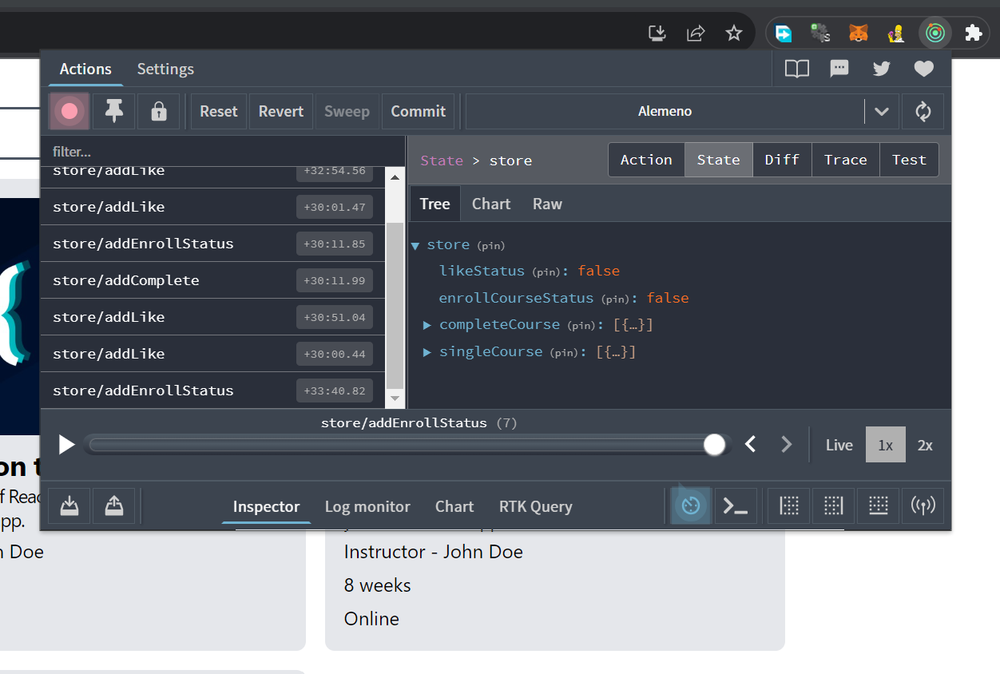

<!-- Here is the Live Website [Website](https://github.com/facebook/create-react-app). -->

## How to Run the Project

1. Clone the repo/ download the zip
2. `npm install` - to install all the dependencies
3. `npm start`

## Demo Video

<video width="640" height="360" controls>
  <source src="/src/images/AlemenoFInal.mp4" type="video/mp4">
  Your browser does not support the video tag.
</video>

Check out this video demonstration of our application in action.

## State Management

